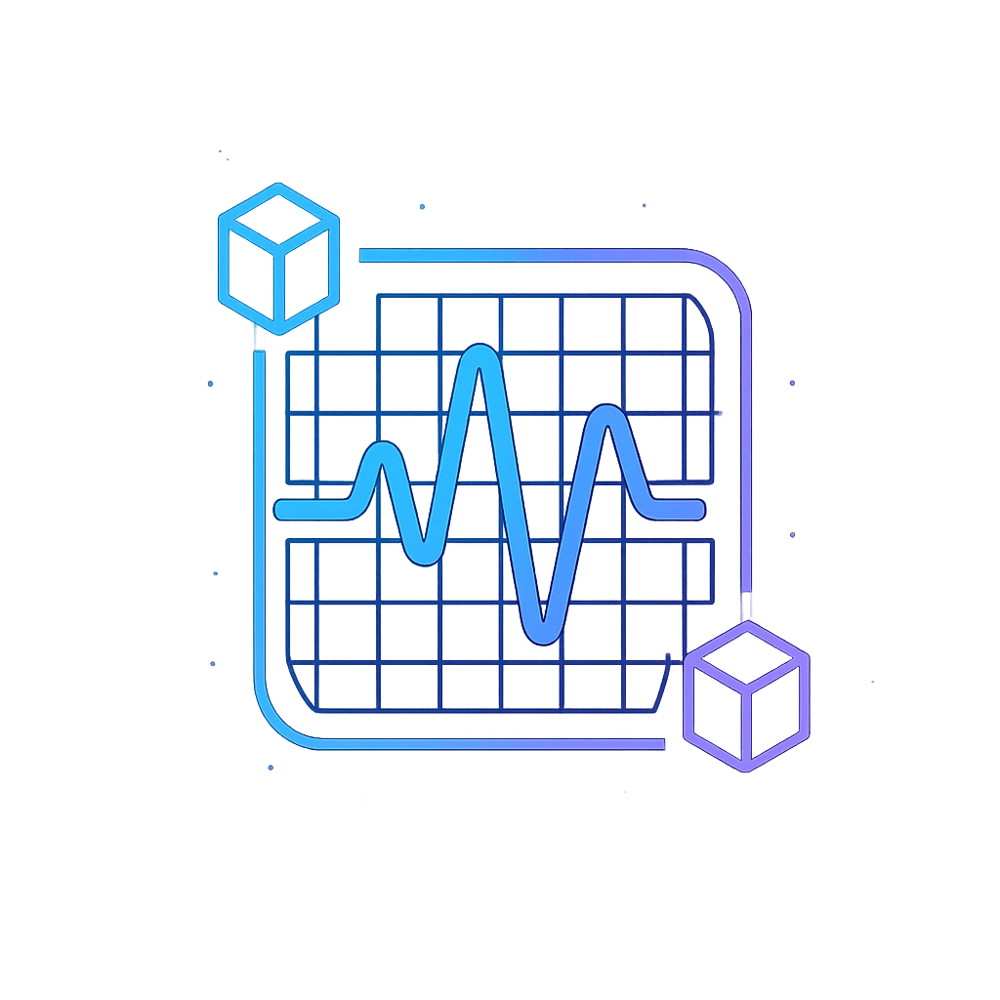

# 🎵 BlockBeats 3.0 - Web3's First Community-Powered Musical Signature Generator

<div align="center">



**We turn music into immutable art. It's Web3's first community-powered musical signature generator — mintable, shareable, tradable... And give them full ownership of their creation through NFTs.**

[](https://starknet.io/)
[](https://nextjs.org/)
[](https://www.typescriptlang.org/)
[](https://firebase.google.com/)

[🏆 **2nd Place Winner - Starknet Hackathon**](https://www.youtube.com/watch?v=Uk9lCM9xS5Y) | [📺 **Watch Demo**](https://www.youtube.com/watch?v=W84Qst6bHxU&t=20s)

</div>

---

## 🌟 Vision & Mission

### 🎯 Vision
To become the leading platform for inclusive, creative, and immersive musical experiences on the Web3 space — where music, visual art, and technology converge to empower both artists and audiences worldwide.

### 🚀 Mission
**BlockBeats 3.0** is committed to democratizing access to music creation and NFT monetization, fostering innovation in audiovisual expression, and enabling new forms of interaction through cutting-edge technologies.

---

## ✨ Key Features

### 🎛️ **Music Creation Studio**
- **🎨 Music Drawing Machine**: Compose 8-bit melodies as pixel-art with MIDI compatibility
- **🥁 Drum Designer Machine**: Create custom drum patterns with an intuitive grid interface
- **🎹 MIDI Support**: Connect your MIDI controller for professional music creation
- **🎵 Real-time Playback**: Hear your creations instantly with tempo control

### 🎨 **Visual Music Experience**
- **Pixel Art Generation**: Transform musical notes into beautiful pixel art
- **Frequency Visualization**: See your music in stunning visual representations
- **Color Mapping**: Each note creates unique colors and patterns
- **Interactive Canvas**: Click to compose, draw to create

### 🏆 **Character Progression System**
- **🤖 Evolving Avatars**: 10 unique character phases that evolve with your progress
- **📊 Stats Tracking**: Energy, Creativity, XP, and Level progression
- **🎁 Reward System**: Earn BBC Coins and unlock new features
- **🎉 Level Up Animations**: Celebratory effects and sound design

### 🎰 **Gamification Elements**
- **🎲 Vegas Mint Game**: Spin to win rewards and special items
- **📅 Daily Rewards**: Login bonuses and streak rewards
- **🏅 Achievement System**: Unlock badges and special recognition
- **💎 Premium Features**: Advanced tools for power users

### 🖼️ **NFT Marketplace & Collections**
- **🎵 Musical NFTs**: Mint your creations as unique digital assets
- **🔄 Trading System**: Buy, sell, and trade musical NFTs
- **📚 Collections**: Organize your NFTs into themed collections
- **🌟 Top Collections**: Discover trending and popular creations
- **👥 Community Gallery**: Explore creations from other artists

### 🌐 **Web3 Integration**
- **🔗 Starknet Network**: Built on Starknet for fast, cheap transactions
- **👛 Wallet Support**: 
  - **Argent X** - Secure and user-friendly
  - **Braavos** - Advanced features and security
- **🔐 Decentralized Identity**: Own your creations with true Web3 ownership
- **💱 Token Economics**: BBC Coins for in-app rewards and features

### 📊 **Analytics & Insights**
- **🚀 Vercel Analytics**: Real-time performance metrics and user behavior
- **📈 Google Analytics 4**: Comprehensive user journey tracking
- **🎵 Music Creation Analytics**: Track machine usage and creation patterns
- **🖼️ NFT Activity Tracking**: Monitor minting, trading, and marketplace interactions
- **🎮 Gamification Metrics**: Level progression, rewards, and engagement
- **👛 Wallet Connection Analytics**: Track Web3 adoption and usage patterns
- **🔒 Privacy-First**: GDPR compliant with no personal data collection

---

## 🛠️ Technology Stack

### **Frontend**
- **Next.js 14** - React framework with App Router
- **TypeScript** - Type-safe development
- **CSS Modules** - Scoped styling with animations
- **Framer Motion** - Smooth animations and transitions

### **Web3 & Blockchain**
- **Starknet** - Layer 2 scaling solution
- **@starknet-react/core** - React hooks for Starknet
- **starknetkit** - Wallet connection utilities
- **Sepolia Testnet** - Development and testing

### **Backend & Storage**
- **Firebase** - Real-time database and authentication
- **Firestore** - Document-based data storage
- **Firebase Auth** - User management and security

### **Audio & MIDI**
- **Web Audio API** - High-quality audio processing
- **MIDI.js** - MIDI controller integration
- **Custom Audio Engine** - Optimized for real-time playback

### **UI/UX Libraries**
- **React Hot Toast** - Beautiful notifications
- **React Responsive Modal** - Accessible modals
- **React Avatar** - User avatar generation
- **Chart.js** - Data visualization

### **Analytics & Monitoring**
- **@vercel/analytics** - Real-time performance and user analytics
- **@next/third-parties** - Optimized third-party script integration
- **Google Analytics 4** - Advanced user behavior tracking
- **Custom Event Tracking** - BlockBeats-specific metrics

---

## 🚀 Getting Started

### Prerequisites
- Node.js 18+ 
- Yarn or npm
- A Starknet-compatible wallet (Argent X or Braavos)

### Installation

1. **Clone the repository**
```bash
git clone https://github.com/yourusername/blockbeats.git
cd blockbeats
```

2. **Install dependencies**
```bash
yarn install
# or
npm install
```

3. **Set up environment variables**
```bash
cp .env.example .env.local
# Add your Firebase and Starknet configuration
```

4. **Run the development server**
```bash
yarn dev
# or
npm run dev
```

5. **Open your browser**
Navigate to [http://localhost:3000](http://localhost:3000)

### Wallet Setup
1. Install [Argent X](https://www.argent.xyz/) or [Braavos](https://braavos.app/) wallet
2. Create or import your wallet
3. Switch to Sepolia testnet
4. Get testnet ETH from [Starknet Faucet](https://starknet-faucet.vercel.app/)

---

## 📊 Analytics & Metrics

### **🎯 Tracked Events & Metrics**

BlockBeats includes comprehensive analytics to understand user behavior and optimize the platform:

#### **🎵 Music Creation Analytics**
- **Machine Usage**: Track which music creation tools are most popular
- **Creation Patterns**: Monitor tempo preferences, frequency ranges, and style choices
- **Session Duration**: Measure time spent in creative sessions
- **MIDI Integration**: Track hardware controller usage

#### **🖼️ NFT & Marketplace Metrics**
- **Minting Activity**: Monitor NFT creation rates and trends
- **Trading Volume**: Track marketplace interactions and transactions
- **Collection Growth**: Measure user collection building behavior
- **Popular Genres**: Identify trending music styles and patterns

#### **🎮 Gamification Analytics**
- **Level Progression**: Track user advancement through character levels
- **Reward Engagement**: Monitor daily rewards and achievement completion
- **Vegas Game Activity**: Measure engagement with gamification features
- **Retention Metrics**: Track user return rates and session frequency

#### **🌐 Web3 Adoption Tracking**
- **Wallet Connections**: Monitor Argent X vs Braavos usage
- **Network Activity**: Track Starknet transaction patterns
- **User Onboarding**: Measure Web3 adoption and learning curves
- **Cross-Platform Usage**: Track desktop vs mobile engagement

### **📈 Analytics Setup**

#### **Vercel Analytics (Automatic)**
- ✅ **Zero Configuration** - Works immediately after deployment
- 📊 **Real-time Dashboard** - Available in Vercel project settings
- 🚀 **Performance Metrics** - Core Web Vitals and loading times
- 👥 **User Insights** - Geographic distribution and device usage

#### **Google Analytics 4 (Optional)**
1. **Create GA4 Property** at [analytics.google.com](https://analytics.google.com)
2. **Get Measurement ID** (format: `G-XXXXXXXXXX`)
3. **Add Environment Variable**:
   ```bash
   NEXT_PUBLIC_GA_ID=G-XXXXXXXXXX
   ```
4. **Deploy** - Analytics will start collecting data immediately

#### **Custom Event Tracking**
```typescript
// Example: Track music creation
const { trackMusicCreation } = useBlockBeatsAnalytics();
trackMusicCreation('drawing'); // Tracks drawing machine usage

// Example: Track NFT minting
const { trackNFTCreation } = useBlockBeatsAnalytics();
trackNFTCreation('My Song', 'drawing', 120); // Tracks NFT creation
```

### **🔒 Privacy & Compliance**
- **GDPR Compliant**: No personal data collection
- **Privacy-First**: Wallet addresses are hashed for anonymity
- **Opt-Out Ready**: Users can disable tracking if needed
- **Data Minimization**: Only essential metrics are collected

### **📊 Key Performance Indicators (KPIs)**
- **Daily Active Users (DAU)**
- **Music Creation Rate** (NFTs minted per day)
- **User Retention** (7-day, 30-day)
- **Wallet Connection Rate**
- **Average Session Duration**
- **Feature Adoption Rate**

---

## 🎮 How to Use

### 1. **Connect Your Wallet**
- Click "Connect Wallet" in the navigation
- Choose between Argent X or Braavos
- Approve the connection

### 2. **Create Your First Musical NFT**
- Navigate to the **Studio**
- Select **Music Drawing Machine**
- Draw on the canvas to create melodies
- Adjust tempo and frequency ranges
- Save your creation as an NFT

### 3. **Explore the Marketplace**
- Browse community creations
- Play and preview musical NFTs
- Trade with other users
- Create collections

### 4. **Level Up Your Character**
- Create more music to gain XP
- Watch your avatar evolve
- Earn BBC Coins and rewards
- Unlock new features

---

## 🏗️ Project Structure

```
blockbeats/
├── src/
│   ├── app/                    # Next.js App Router
│   │   ├── assets/styles/      # CSS Modules (organized)
│   │   │   ├── components/     # Component-specific styles
│   │   │   ├── layouts/        # Layout styles
│   │   │   └── pages/          # Page-specific styles
│   │   └── globals.css         # Global styles
│   ├── components/             # React components (organized)
│   │   ├── features/           # Feature components
│   │   ├── layout/             # Layout components
│   │   ├── machines/           # Music creation tools
│   │   │   ├── drumDesigner/   # Drum machine
│   │   │   └── musicDrawingMachine/ # Pixel music creator
│   │   ├── modals/             # Modal components
│   │   └── ui/                 # UI components
│   ├── context/                # React contexts
│   ├── hooks/                  # Custom React hooks
│   ├── pages/                  # Page components (organized)
│   │   ├── auth/               # Authentication pages
│   │   ├── dashboard/          # Dashboard pages
│   │   ├── marketplace/        # Marketplace pages
│   │   ├── studio/             # Studio pages
│   │   └── collections/        # Collection pages
│   ├── types/                  # TypeScript definitions
│   └── utils/                  # Helper functions
├── public/                     # Static assets (organized)
│   ├── images/                 # All images
│   │   ├── avatars/            # Character phases
│   │   ├── backgrounds/        # Background images
│   │   ├── logos/              # Logo files
│   │   ├── characters/         # Character images
│   │   ├── store/              # Store items
│   │   └── launchpad/          # Launchpad images
│   ├── sounds/                 # Audio files
│   └── ...
└── firebase.ts                 # Firebase configuration
```

---

## 🎯 Roadmap

### **Phase 1: Foundation** ✅
- [x] Core music creation tools
- [x] Basic NFT minting
- [x] Wallet integration
- [x] Character progression system

### **Phase 2: Enhancement** 🚧
- [ ] **Voice Music Machine** - AI-powered voice-to-melody conversion
- [ ] **Launchpad Machine** - Sample triggering and loop creation
- [ ] **Advanced MIDI Support** - Full MIDI controller integration
- [ ] **Social Features** - Follow artists, like, and comment

### **Phase 3: Expansion** 📋
- [ ] **Mobile App** - iOS and Android applications
- [ ] **VR/AR Integration** - Immersive music creation experience
- [ ] **AI Collaboration** - AI-assisted composition tools
- [ ] **Cross-chain Support** - Multi-blockchain compatibility

### **Phase 4: Ecosystem** 🔮
- [ ] **Artist Marketplace** - Professional tools for musicians
- [ ] **Educational Platform** - Music theory and Web3 tutorials
- [ ] **Live Events** - Virtual concerts and competitions
- [ ] **DAO Governance** - Community-driven platform decisions

### **Phase 5: Metaverse** 🌌
- [ ] **Virtual Worlds** - 3D music creation environments
- [ ] **Holographic Arena** - Immersive performance spaces
- [ ] **Drone Shows** - Real-world music visualization
- [ ] **Smart City Integration** - Urban music experiences

---

## 🤝 Contributing

We welcome contributions from the community! Here's how you can help:

### **Ways to Contribute**
- 🐛 **Bug Reports** - Help us identify and fix issues
- 💡 **Feature Requests** - Suggest new functionality
- 🎨 **UI/UX Improvements** - Enhance the user experience
- 🎵 **Audio Assets** - Contribute sounds and samples
- 📚 **Documentation** - Improve guides and tutorials
- 🌐 **Translations** - Help us reach global audiences

### **Development Guidelines**
1. Fork the repository
2. Create a feature branch (`git checkout -b feature/amazing-feature`)
3. Commit your changes (`git commit -m 'Add amazing feature'`)
4. Push to the branch (`git push origin feature/amazing-feature`)
5. Open a Pull Request

### **Code Standards**
- Follow TypeScript best practices
- Use meaningful commit messages
- Add tests for new features
- Update documentation as needed

---

## 🏆 Achievements

- **🥈 2nd Place** - Starknet Hackathon 2024
- **🌟 Featured** - Multiple Web3 music showcases
- **👥 1000+** - Community members
- **🎵 500+** - Musical NFTs created
- **🔥 Trending** - On Starknet ecosystem
- **📊 100%** - Analytics coverage across all features
- **🔒 GDPR Compliant** - Privacy-first data collection
- **⚡ Real-time** - Live performance monitoring

---

## 📺 Media & Resources

### **Demo Videos**
- [🎬 Full Demo Presentation](https://www.youtube.com/watch?v=W84Qst6bHxU&t=20s)
- [🏆 Hackathon Presentation](https://www.youtube.com/watch?v=Uk9lCM9xS5Y)
- [🌍 Web3 Music Revolution](https://www.youtube.com/watch?v=6aGIqnu1UP8)

### **Community**
- [📺 YouTube Channel](https://www.youtube.com/@BlockBeats3.0)
- [🐦 Twitter](https://x.com/blockbeats3pt0)
- [💬 Discord](https://discord.gg/Cha49mwX)
- [📖 Documentation](https://joses-organization-73.gitbook.io/blockbeats-3.0)

---

## 📄 License

This project is licensed under the MIT License - see the [LICENSE](LICENSE) file for details.

---

## 🙏 Acknowledgments

- **Starknet Foundation** - For the amazing ecosystem and support
- **Argent & Braavos** - For excellent wallet solutions
- **Firebase** - For reliable backend infrastructure
- **Community** - For feedback, testing, and contributions
- **Open Source** - For the incredible tools and libraries

---

## 📞 Contact & Support

- **Email**: josegomez.dev@gmail.com
- **Discord**: [Join our community](https://discord.gg/Cha49mwX)
- **Twitter**: [@blockbeats](https://x.com/blockbeats3pt0)
- **Website**: [https://blockbeats-tau.vercel.app/](https://blockbeats-tau.vercel.app/)

---

<div align="center">

**Made with ❤️ by the BlockBeats Team**

*Turning music into immutable art, one pixel at a time.*

[⬆️ Back to Top](#-blockbeats-30---web3s-first-community-powered-musical-signature-generator)

</div>